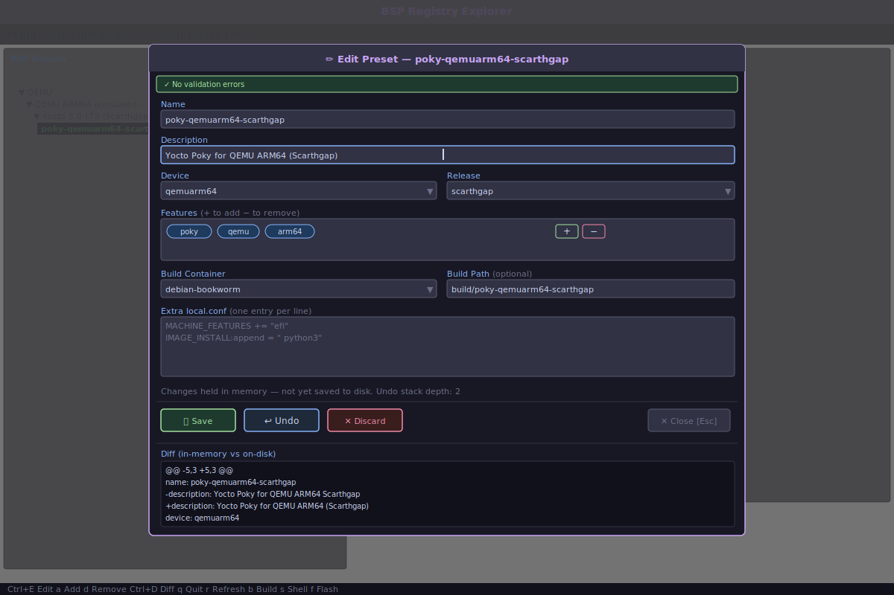

# bsp-registry-tools

Python tools to build, fetch, and work with Yocto-based BSPs using the [KAS](https://kas.readthedocs.io/) build system.

## Overview

`bsp-registry-tools` provides a command-line interface, an interactive GUI launcher, and a Python API for managing Advantech Board Support Packages (BSPs). It uses YAML-based registry files to define BSP configurations, build environments, and Docker containers, making reproducible Yocto builds straightforward.

### Key Features

- 📋 **BSP registry management** via YAML configuration files
- 🌐 **Automatic remote registry fetching** — clone/update a remote registry with no manual setup
- 🐳 **Docker container support** for reproducible build environments
- 🔧 **KAS integration** for Yocto-based builds (`kas`, `kas-container`)
- 🖥️ **Interactive shell** access to build environments
- 🔄 **Environment variable expansion** (`$ENV{VAR}` syntax)
- 📤 **Configuration export** for sharing and archiving build configs
- ✅ **Comprehensive validation** of configurations before building
- 📂 **Registry splitting** — compose a registry from multiple files using the `include` directive
- 🚀 **Interactive TUI launcher** (`bsp-explorer`) — visual alternative to the CLI
- ✏️ **Registry editing** — add, update, and remove devices/releases/features/presets via CLI (`bsp registry`) or the TUI Edit Panel

## Installation

### From PyPI

```bash
pip install bsp-registry-tools
```

### With GUI support

```bash
pip install 'bsp-registry-tools[gui]'
```

### From Source

```bash
git clone https://github.com/Advantech-EECC/bsp-registry-tools.git
cd bsp-registry-tools
pip install .
```

### Dependencies

- Python 3.8+
- [PyYAML](https://pyyaml.org/) >= 6.0
- [dacite](https://github.com/konradhalas/dacite) >= 1.6.0
- [ruamel.yaml](https://pypi.org/project/ruamel.yaml/) >= 0.18.0 — used by the registry write layer
- [kas](https://kas.readthedocs.io/) >= 4.7
- [colorama](https://github.com/tartley/colorama) >= 0.4.6
- *(optional)* [textual](https://textual.textualize.io/) >= 8.0.0 — required for `bsp-explorer` GUI

## Quick Start

### Zero-Config Usage (Remote Registry)

If you have no local registry file, `bsp` automatically clones the default
[Advantech BSP registry](https://github.com/Advantech-EECC/bsp-registry) into
`~/.cache/bsp/registry` and keeps it up-to-date on every run:

```bash
# First run: clones the registry, then lists BSPs
bsp list

# Subsequent runs: pulls latest changes, then lists BSPs
bsp list

# Skip the network update (useful offline or in CI)
bsp --no-update list

# Use a different remote or branch
bsp --remote https://github.com/my-org/bsp-registry.git --branch dev list
```

### Manual Registry Usage

### 1. Create a BSP Registry File

Create a `bsp-registry.yaml` or `bsp-registry.yml` file (see [examples/bsp-registry.yaml](examples/bsp-registry.yaml)):

```yaml
specification:
  version: "2.0"

environment:
  variables:
    - name: "GITCONFIG_FILE"
      value: "$ENV{HOME}/.gitconfig"

# Named environment: container + variables used for all builds by default
environments:
  default:
    container: "debian-bookworm"
    variables:
      - name: "DL_DIR"
        value: "$ENV{HOME}/yocto-cache/downloads"
      - name: "SSTATE_DIR"
        value: "$ENV{HOME}/yocto-cache/sstate"

containers:
  debian-bookworm:
    image: "bsp/registry/debian/kas:5.1"
    file: Dockerfile
    args:
      - name: "DISTRO"
        value: "debian-bookworm"
      - name: "KAS_VERSION"
        value: "5.1"

registry:
  # frameworks and distro define the build system hierarchy (optional but recommended)
  frameworks:
    - slug: yocto
      description: "Yocto Project build system"
      vendor: "Yocto Project"
      includes:
        - kas/yocto/yocto.yaml

  distro:
    - slug: poky
      description: "Poky (Yocto Project reference distro)"
      framework: yocto     # links distro to a framework for feature compatibility checks
      includes:
        - kas/yocto/distro/poky.yaml

  # devices define hardware targets (KAS includes listed flat, no nested build: block)
  devices:
    - slug: qemuarm64
      description: "QEMU ARM64 (emulated)"
      vendor: qemu
      soc_vendor: arm
      includes:
        - kas/qemu/qemuarm64.yaml

  releases:
    - slug: scarthgap
      description: "Yocto 5.0 LTS (Scarthgap)"
      distro: poky
      yocto_version: "5.0"
      includes:
        - kas/scarthgap.yaml

  # bsp presets name a device + release + features combination.
  # Use "releases" (plural) to target multiple releases without repetition:
  bsp:
    - name: poky-qemuarm64
      description: "Poky QEMU ARM64"
      device: qemuarm64
      releases: [scarthgap, styhead]   # expands to poky-qemuarm64-scarthgap / poky-qemuarm64-styhead
      features: []
      build:
        container: "debian-bookworm"
    # Single-release entry (backward compatible):
    - name: poky-qemuarm64-scarthgap-ota
      description: "Poky QEMU ARM64 Scarthgap with OTA"
      device: qemuarm64
      release: scarthgap
      features: [ota]
      build:
        container: "debian-bookworm"
        path: build/poky-qemuarm64-scarthgap-ota
```

### 2. List Available BSPs

```bash
# With an explicit registry file
bsp --registry bsp-registry.yaml list

# Or simply if bsp-registry.yaml (or bsp-registry.yml) is in the current directory
bsp list
```

```
- poky-qemuarm64-scarthgap: Poky QEMU ARM64 Scarthgap (Yocto 5.0 LTS)
```

### 3. Build a BSP

```bash
bsp build poky-qemuarm64-scarthgap
```

### 4. Enter Interactive Shell

```bash
bsp shell poky-qemuarm64-scarthgap
```

### 5. Launch the Interactive GUI

```bash
# Install the GUI extra first
pip install 'bsp-registry-tools[gui]'

# Then launch the TUI launcher
bsp-explorer

# Or via the main CLI
bsp gui
bsp --gui

# Serve the TUI in a browser (Textual web server)
bsp-explorer-web
```

**Terminal** (`bsp-explorer`):


**Browser** (`bsp-explorer-web`):


## GUI Launcher (`bsp-explorer`)

`bsp-explorer` is a Terminal User Interface (TUI) that provides a visual, interactive
alternative to the CLI — similar in spirit to the
[Advantech BSP Launcher](https://docs.aim-linux.advantech.com/docs/utility/bsplauncher/).


### Features

| Feature | Description |
|---------|-------------|
| **BSP tree** | Vendor → Device → Release → BSP preset hierarchy with filter/search support |
| **BSP details** | Select a BSP to view its description, device, release, features, and build path |
| **Build environment** | Shows the Docker container, named environment, and resolved variables |
| **Build artifacts** | Automatically scans the Yocto deploy directory for `.wic` images and kernel images (`uImage`, `zImage`, `Image`, `fitImage`) — updated after each successful build |
| **Build** | Opens a dialog to choose build options (clean, checkout-only), then streams output to the log (`b`). Output is saved to a timestamped log file (`bsp-build-YYYYMMDD-HHMMSS.log`) in the build folder |
| **Shell** | Exits the TUI and launches an interactive `bsp shell` session in the restored terminal (`s`) |
| **Flash** | Auto-discovers removable drives (USB, SD card, eMMC), selects a flash image, then writes it to the target device using `bmaptool` or `dd` (`f`) |
| **Export** | Export KAS configuration and stream output to the log panel (`e`) |
| **Edit registry** | Press **Ctrl+E** to open the Edit Panel modal for the selected preset; **`a`** adds a new entity; **`d`** removes with reference-check; **Ctrl+D** shows the diff |
| **Cancel** | Terminates a running build (kills the entire process group) (`x`) |
| **Refresh** | Reload the registry (pull latest from remote if applicable) (`r`) |
| **Output log** | Real-time streaming of command output in a scrollable panel |
| **Keyboard-first** | Full keyboard navigation; footer shows all available shortcuts |
| **Registry info** | Top bar displays the active registry URL and branch |

### Launching options

```bash
# Use the default (remote) registry
bsp-explorer

# Use a local registry file
bsp-explorer --registry ./bsp-registry.yaml

# Use a custom remote registry
bsp-explorer --remote https://github.com/my-org/bsp-registry.git --branch dev

# Skip the remote update (faster, offline)
bsp-explorer --no-update

# Serve the TUI in a web browser (requires Textual's web extra)
bsp-explorer-web
```

**TUI in terminal** (`bsp-explorer`):


**Registry Edit Panel** (Ctrl+E):



**TUI in browser** (`bsp-explorer-web`):


### CLI vs GUI comparison

| Capability | CLI (`bsp`) | GUI (`bsp-explorer`) |
|-----------|-------------|----------------------|
| List BSPs | `bsp list` | Visual table, keyboard-navigable |
| Build BSP | `bsp build <name>` | Select row → press `b` |
| Shell access | `bsp shell <name>` | Shows equivalent CLI command |
| Export config | `bsp export <name>` | Select row → press `e` |
| List containers | `bsp containers` | Press `c` |
| **Edit registry** | `bsp registry add/edit/remove/show` | Ctrl+E, `a`, `d` |
| **Validate registry** | `bsp registry validate` | Inline error banner in Edit Panel |
| **Show diff** | `bsp registry diff` | Ctrl+D → log panel |
| Real-time output | stdout/stderr | Integrated scrollable log panel |
| Scriptable / CI | ✅ Yes | ❌ Requires a terminal |

## CLI Reference

```
usage: bsp [-h] [--verbose] [--registry REGISTRY] [--no-color]
           [--remote REMOTE] [--branch BRANCH] [--update | --no-update]
           [--local] [--gui]
           {gui,build,list,containers,tree,export,shell,flash,registry} ...

Advantech Board Support Package Registry

positional arguments:
  {gui,build,list,containers,tree,export,shell,flash,registry}
                        Command to execute
    gui                 Launch the interactive GUI launcher
    build               Build an image for BSP
    list                List available BSPs
    containers          List available containers
    tree                Display a tree view of the BSP registry
    export              Export BSP configuration
    shell               Enter interactive shell for BSP
    flash               Flash a build image to a block device (SD card / eMMC)
    registry            Edit the BSP registry (add/remove/update entities)

options:
  -h, --help            show this help message and exit
  --verbose, -v         Verbose output
  --registry REGISTRY, -r REGISTRY
                        BSP Registry file (local path; skips remote fetch)
  --no-color            Disable colored output
  --remote REMOTE       Remote registry git URL
                        (default: https://github.com/Advantech-EECC/bsp-registry.git)
  --branch BRANCH       Remote registry branch (default: main)
  --update              Update the cached registry clone before use (default)
  --no-update           Skip updating the cached registry clone
  --local               Force local registry lookup only (do not use remote)
  --gui                 Launch the interactive GUI (requires the [gui] extra)
```

### Registry Resolution Priority

The tool determines which registry file to use in the following order:

1. **`--registry <path>`** — explicit local file, remote fetch is skipped entirely.
2. **`--local`** — use `./bsp-registry.yaml` or `./bsp-registry.yml` in the current directory; no network access.
3. **`bsp-registry.yaml` exists in the current directory** — auto-detect (preferred extension).
4. **`bsp-registry.yml` exists in the current directory** — auto-detect (alternate extension).
5. **Otherwise** — clone/update the remote registry into `~/.cache/bsp/registry` via `RegistryFetcher`.

### Global Options

| Option | Description |
|--------|-------------|
| `--verbose`, `-v` | Enable verbose/debug output |
| `--registry REGISTRY`, `-r REGISTRY` | Path to BSP registry file (local override) |
| `--no-color` | Disable colored output |
| `--remote REMOTE` | Remote registry git URL (default: Advantech BSP registry) |
| `--branch BRANCH` | Remote registry branch (default: `main`) |
| `--update` / `--no-update` | Update cached registry clone before use (default: update) |
| `--local` | Force local lookup; never contact remote |

### Commands

#### `list` — List available BSPs

```bash
bsp list
bsp --registry my-registry.yaml list
```

#### `containers` — List available container definitions

```bash
bsp containers
```

#### `tree` — Display a tree view of the BSP registry

```bash
bsp tree
bsp tree --full
bsp tree --compact
bsp --no-color tree
bsp --registry my-registry.yaml tree
```

Renders the full registry as a colored ASCII tree, grouped into sections:
**Frameworks**, **Distros**, **Releases** (with vendor overrides), **Devices**,
**Features** (with vendor overrides in full mode), and **BSP Presets** (with device, release, and feature details).
Use `--no-color` to disable colors (e.g. for scripts or log files).

| Option | Description |
|--------|-------------|
| `--full` | Show full details including includes lists, vendor overrides for releases and features, and override slugs for presets |
| `--compact` | Show compact output with names/slugs only (no sub-items) |

**Example output (`bsp tree`):**

```
BSP Registry
├── Frameworks (1)
│   └── yocto: Yocto Project (vendor: yocto)
├── Distros (1)
│   └── poky: Poky (vendor: yocto, framework: yocto)
├── Releases (1)
│   └── scarthgap: Yocto 5.0 LTS [Yocto 5.0]
│       ├── distro: poky
│       └── vendor override: advantech (sub-releases: imx-6.6.53)
├── Devices (2)
│   ├── qemu-arm64: QEMU ARM64 (vendor: qemu, soc_vendor: arm)
│   └── imx8qm: i.MX8 QM (vendor: advantech, soc_vendor: nxp, soc_family: imx8)
├── Features (2)
│   ├── ota: OTA Update
│   └── secure-boot: Secure Boot [requires vendor: ['advantech']]
└── BSP Presets (2)
    ├── qemu-arm64-scarthgap: QEMU ARM64 Scarthgap
    │   └── device: qemu-arm64  release: scarthgap
    └── imx8qm-scarthgap: i.MX8 QM Scarthgap
        ├── device: imx8qm  release: scarthgap
        ├── vendor release: imx-6.6.53
        └── features: ota, secure-boot
```

**Example output (`bsp tree --full`):**

In `--full` mode all includes lists are expanded and vendor overrides for both releases and features are shown as nested sub-trees:

```
BSP Registry
├── Releases (1)
│   └── scarthgap: Yocto 5.0 LTS [Yocto 5.0]
│       ├── distro: poky
│       ├── includes: kas/poky/scarthgap.yaml
│       └── vendor override: advantech (distro: fsl-imx-xwayland)
│           ├── includes: kas/yocto/vendors/advantech/scarthgap.yaml
│           └── vendor release: imx-6.6.53: Scarthgap for i.MX 6.6.53
│               └── includes:
│                   └── kas/yocto/vendors/advantech/nxp/imx-6.6.53.yaml
└── Features (1)
    └── rauc: Enable RAUC support in the Yocto image [requires compatible_with: yocto]
        ├── includes:
        │   └── features/ota/rauc/rauc.yml
        └── vendor override: advantech
            ├── includes: features/ota/rauc/advantech-rauc.yml
            └── soc vendor: nxp
                ├── includes: features/ota/rauc/modular-bsp-ota-nxp.yml
                └── vendor release: imx-6.6.53: RAUC for i.MX 6.6.53
                    └── includes:
                        └── features/ota/rauc/rauc-imx-6.6.53.yml
```

#### `build` — Build a BSP image

```bash
bsp build <bsp_name> [--clean] [--checkout]
```

| Option | Description |
|--------|-------------|
| `--clean` | Clean build directory before building |
| `--checkout` | Validate configuration and checkout repos without building |

**Examples:**

```bash
# Full build
bsp build poky-qemuarm64-scarthgap

# Checkout/validate only (fast, no build)
bsp build poky-qemuarm64-scarthgap --checkout
```

When a build is triggered via the `bsp-explorer` GUI, the full output is saved to a timestamped log file inside the BSP's build directory (e.g. `build/poky-qemuarm64-scarthgap/bsp-build-20260406-205840.log`). Each build creates a new log file, so previous build logs are preserved.

#### `shell` — Interactive shell in build environment

```bash
bsp shell <bsp_name> [--command COMMAND]
```

| Option | Description |
|--------|-------------|
| `--command COMMAND`, `-c COMMAND` | Execute a specific command instead of starting interactive shell |

**Examples:**

```bash
# Interactive shell
bsp shell poky-qemuarm64-scarthgap

# Execute single command
bsp shell poky-qemuarm64-scarthgap --command "bitbake core-image-minimal"
```

#### `export` — Export BSP configuration

```bash
bsp export <bsp_name> [--output OUTPUT]
```

| Option | Description |
|--------|-------------|
| `--output OUTPUT`, `-o OUTPUT` | Output file path (default: stdout) |

**Examples:**

```bash
# Print to stdout
bsp export poky-qemuarm64-scarthgap

# Save to file
bsp export poky-qemuarm64-scarthgap --output exported-config.yaml
```

#### `flash` — Flash a build image to a block device

Writes the most recently built `.wic` (or `.img`) image from the BSP's deploy directory to an SD card or eMMC target. Uses `bmaptool` for efficient sparse writes when a `.bmap` sidecar is present, or falls back to `dd`.

```bash
bsp flash <bsp_name> --target <device> [--image <path>]
```

| Option | Description |
|--------|-------------|
| `--target TARGET`, `-t TARGET` | Target block device (e.g. `/dev/sda`, `/dev/mmcblk0`) |
| `--image IMAGE`, `-i IMAGE` | Path to the image file to flash (auto-selected from deploy dir if omitted) |

**Examples:**

```bash
# Flash to USB drive (auto-selects the latest .wic image)
bsp flash poky-qemuarm64-scarthgap --target /dev/sda

# Flash a specific image file
bsp flash poky-qemuarm64-scarthgap --target /dev/mmcblk0 --image path/to/image.wic
```

#### `registry` — Edit the BSP registry

Create, validate, and update registry entries without manually editing YAML.
See [docs/registry-editing.md](docs/registry-editing.md) for the full
reference.

```
bsp registry <action> [<entity>] [options]
```

| Action | Description |
|--------|-------------|
| `init` | Create a minimal `bsp-registry.yaml` skeleton |
| `validate` | Check for errors and warnings; exit non-zero on errors |
| `diff` | Show what changed vs the on-disk (or last-committed) file |
| `add <entity>` | Add a new device / release / feature / preset / vendor / distro / container |
| `edit <entity> <slug>` | Update specific fields; `--editor` opens `$EDITOR` |
| `remove <entity> <slug>` | Remove an entry (checks for dangling references; `--force` skips confirm) |
| `show <entity> <slug>` | Pretty-print a single entity's YAML block |

**Quick examples:**

```bash
# Initialise a new registry
bsp registry init

# Validate the current registry
bsp registry validate

# Add a hardware device
bsp registry add device --slug myboard --vendor acme --soc-vendor nxp \
  --description "My Custom Board"

# Update a preset description
bsp registry edit preset myboard-scarthgap \
  --description "Updated description"

# Remove a device (with reference check)
bsp registry remove device myboard

# Show a preset as YAML
bsp registry show preset myboard-scarthgap
```

## Registry Configuration Reference

The BSP registry is a YAML file following **schema v2.0**.  See [docs/registry-v2.md](docs/registry-v2.md) for the full reference.  Key top-level sections:

### `specification`

```yaml
specification:
  version: "2.0"
```

### `include` (optional)

Split a large registry across multiple files using the `include` directive.
Paths are relative to the file that contains the directive.

```yaml
include:
  - devices/boards.yaml
  - releases/scarthgap.yaml
```

Each included file is merged before the root file's own content.  Lists
(e.g. `devices`, `releases`, `features`, `environment`) are concatenated; dicts
(e.g. `containers`, `environments`) are merged recursively; scalars use the root
file's value.
Included files can themselves contain further `include` directives, and
circular references are detected at load time.

See [docs/registry-v2.md](docs/registry-v2.md#include-optional) for full details.

### `environment`

Global build environment applied to all builds.  Groups `variables` (supports `$ENV{VAR_NAME}` expansion) and `copy` (file-copy entries executed inside the build environment before every build) under a single key.

```yaml
environment:
  variables:
    - name: "GITCONFIG_FILE"
      value: "$ENV{HOME}/.gitconfig"
    - name: "DL_DIR"
      value: "$ENV{HOME}/yocto-cache/downloads"
    - name: "SSTATE_DIR"
      value: "$ENV{HOME}/yocto-cache/sstate"
  copy:
    - scripts/global-setup.sh: build/
    - config/global.conf: build/conf/
```

Both `variables` and `copy` are optional.  Global copies are merged first, before named-environment and device copies.

### `environments`

Named environments bundle a container reference, environment variables, and optional file-copy entries together.  The special name `"default"` is used by any release that does not explicitly name an environment.

```yaml
environments:
  default:
    container: "debian-bookworm"
    variables:
      - name: "DL_DIR"
        value: "$ENV{HOME}/yocto-cache/downloads"
  isar-build:
    container: "isar-debian-trixie"
    variables:
      - name: "DL_DIR"
        value: "$ENV{HOME}/isar-cache/downloads"
    # Copy the QEMU run script into every Isar build directory
    copy:
      - isar/scripts/isar-runqemu.sh: build/
```

### `containers`

Docker container definitions for build environments:

```yaml
containers:
  debian-bookworm:
    image: "my-registry/debian/kas:5.1"
    file: Dockerfile
    args:
      - name: "DISTRO"
        value: "debian-bookworm"
      - name: "KAS_VERSION"
        value: "5.1"
  isar-container:
    image: "my-registry/isar/kas:5.1"
    file: Dockerfile.isar
    args: []
    privileged: true    # Run container in privileged mode (required for ISAR builds)
    runtime_args: "-p 2222:2222"  # Extra flags passed to the container engine
```

**Container fields:**

| Field | Type | Default | Description |
|-------|------|---------|-------------|
| `image` | string | — | Docker image name/tag |
| `file` | string | — | Path to Dockerfile for building the image |
| `args` | list | `[]` | Docker build arguments (`name`/`value` pairs) |
| `privileged` | boolean | `false` | Run container with elevated privileges. Required for ISAR builds. |
| `runtime_args` | string | — | Extra flags appended to the container engine `run` invocation (e.g. port-forwarding, `--device` access). Forwarded via `KAS_CONTAINER_ARGS`. |

### `registry.devices`

Hardware device/board definitions:

```yaml
registry:
  devices:
    - slug: qemuarm64
      description: "QEMU ARM64 (emulated)"
      vendor: qemu
      soc_vendor: arm
      includes:
        - kas/qemu/qemuarm64.yaml
```

### `registry.releases`

Yocto/Isar release definitions referencing a distro:

```yaml
registry:
  releases:
    - slug: scarthgap
      description: "Yocto 5.0 LTS (Scarthgap)"
      distro: poky
      yocto_version: "5.0"
      includes:
        - kas/scarthgap.yaml
```

### `registry.bsp`

Named presets — device + release(s) + optional features:

```yaml
registry:
  bsp:
    # Single-release preset (backward compatible)
    - name: poky-qemuarm64-scarthgap
      description: "Poky QEMU ARM64 Scarthgap (Yocto 5.0 LTS)"
      device: qemuarm64
      release: scarthgap
      features: []
      build:              # optional: override container and/or output path
        container: "debian-bookworm"
        path: build/poky-qemuarm64-scarthgap

    # Multi-release preset: use "releases" (plural) to avoid repeating the
    # same entry for every Yocto release.  The resolver expands this into one
    # preset per release, named "{name}-{release_slug}":
    #   poky-qemuarm64-scarthgap  (auto-composed path: build/poky-qemuarm64-scarthgap)
    #   poky-qemuarm64-styhead    (auto-composed path: build/poky-qemuarm64-styhead)
    - name: poky-qemuarm64
      description: "Poky QEMU ARM64"
      device: qemuarm64
      releases: [scarthgap, styhead]
      features: [systemd, debug]
      build:              # optional: container override (path is always auto-composed)
        container: "debian-bookworm"
```

> **Note**: `release` (singular) and `releases` (plural) are mutually exclusive.
> Exactly one must be specified per preset entry.

## KAS Configuration Files

KAS configuration files define Yocto layer repositories, machine settings, and build targets. See the [examples/kas/](examples/kas/) directory for reference configurations.

### QEMU Example Configurations

The `examples/` directory contains ready-to-use KAS configurations for QEMU targets:

| File | Description |
|------|-------------|
| `examples/kas/scarthgap.yaml` | Yocto Scarthgap (5.0 LTS) base configuration |
| `examples/kas/styhead.yaml` | Yocto Styhead (5.1) base configuration |
| `examples/kas/qemu/qemuarm64.yaml` | QEMU ARM64 machine configuration |
| `examples/kas/qemu/qemux86-64.yaml` | QEMU x86-64 machine configuration |
| `examples/kas/qemu/qemuarm.yaml` | QEMU ARM (32-bit) machine configuration |

### KAS File Structure

```yaml
header:
  version: 14
  includes:            # Optional: include other KAS files
    - base.yaml

distro: poky
machine: qemuarm64

target:
  - core-image-minimal

repos:
  poky:
    url: "https://git.yoctoproject.org/poky"
    commit: "abc123..."
    path: "layers/poky"
    layers:
      meta:
      meta-poky:

local_conf_header:
  my_config: |
    DISTRO_FEATURES += "x11"
```

## Python API

You can also use `bsp-registry-tools` as a Python library:

```python
from bsp import BspManager, EnvironmentManager, KasManager, RegistryFetcher, RegistryWriter

# Fetch registry from remote (clone on first call, pull on subsequent)
fetcher = RegistryFetcher()
registry_path = fetcher.fetch_registry(
    repo_url="https://github.com/Advantech-EECC/bsp-registry.git",
    branch="main",
    update=True,
)

# Load and manage BSP registry
manager = BspManager(str(registry_path))
manager.initialize()

# List BSPs programmatically
for bsp in manager.model.registry.bsp:
    print(f"{bsp.name}: {bsp.description}")

# Get a specific BSP
bsp = manager.get_bsp_by_name("poky-qemuarm64-scarthgap")

# Environment variable management with $ENV{} expansion
from bsp import EnvironmentVariable
env_vars = [
    EnvironmentVariable(name="DL_DIR", value="$ENV{HOME}/downloads"),
]
env_manager = EnvironmentManager(env_vars)
print(env_manager.get_value("DL_DIR"))  # Expanded path

# Use KasManager directly
kas = KasManager(
    kas_files=["kas/scarthgap.yaml", "kas/qemu/qemuarm64.yaml"],
    build_dir="build/my-bsp",
    use_container=False,
)
kas.validate_kas_files()
```

## Development

### Setup Development Environment

```bash
git clone https://github.com/Advantech-EECC/bsp-registry-tools.git
cd bsp-registry-tools
pip install -e ".[dev]"
```

### Running Tests

```bash
# Run all tests
pytest

# Run with verbose output
pytest -v

# Run with coverage report
pytest --cov=bsp --cov-report=term-missing

# Run specific test class
pytest tests/test_bsp.py::TestEnvironmentManager -v
```

### Project Structure

```
bsp-registry-tools/
├── bsp/
│   ├── __init__.py           # Public API exports
│   ├── cli.py                # CLI entry point (bsp command)
│   ├── cli_runner.py         # Module runner shim for GUI subprocesses
│   ├── gui.py                # Interactive TUI launcher (bsp-explorer / bsp-explorer-web commands)
│   ├── bsp_manager.py        # Main BSP coordinator (build, shell, flash, export)
│   ├── registry_fetcher.py   # Remote registry clone/update
│   ├── registry_writer.py    # Registry write layer (CRUD, validation, undo, diff, atomic save)
│   ├── kas_manager.py        # KAS build system integration
│   ├── environment.py        # Environment variable management
│   ├── path_resolver.py      # Path utilities
│   ├── models.py             # Dataclass models (v2.0 schema)
│   ├── resolver.py           # V2 resolver: device + release + features → ResolvedConfig
│   ├── utils.py              # YAML / Docker utilities
│   └── exceptions.py         # Custom exceptions
├── pyproject.toml            # Package configuration
├── README.md                 # This file
├── LICENSE                   # Apache 2.0 License
├── docs/
│   ├── registry-v2.md        # Full v2.0 schema reference
│   ├── registry-v1.md        # Legacy v1.0 schema reference
│   ├── migration-v1-to-v2.md # Migration guide from v1 to v2
│   ├── registry-editing.md   # Registry editing CLI + TUI reference
│   └── screenshots/          # TUI and web screenshots (SVGs)
├── tests/
│   ├── conftest.py
│   ├── test_bsp_manager.py
│   ├── test_cli.py
│   ├── test_registry_fetcher.py
│   ├── test_registry_writer.py
│   └── ...
├── examples/
│   ├── bsp-registry.yaml      # Sample v2.0 BSP registry for QEMU targets
│   └── kas/
│       └── ...                # KAS configuration files
└── .github/
    └── workflows/
        ├── tests.yaml         # CI: run tests on push/PR
        └── publish.yaml       # CD: publish to PyPI on release
```

## Publishing to PyPI

This repository uses GitHub Actions for automated publishing.

### Setup

1. Create PyPI and TestPyPI accounts and configure [Trusted Publishers](https://docs.pypi.org/trusted-publishers/):
   - **PyPI**: Add GitHub Actions publisher for `Advantech-EECC/bsp-registry-tools`
   - **TestPyPI**: Same configuration on test.pypi.org

2. Create GitHub Environments named `pypi` and `testpypi` in your repository settings.

### Publish Workflow

**Automatic (on GitHub Release):**
- Creating a non-prerelease GitHub Release automatically publishes to both TestPyPI and PyPI.
- Creating a prerelease publishes to TestPyPI only.

**Manual:**
```
GitHub → Actions → "Publish to PyPI" → Run workflow → Select environment
```

### Build Locally

```bash
pip install build
python -m build
# Artifacts are in dist/
```

## Architecture

### Classes

| Class | Description |
|-------|-------------|
| `BspManager` | Main coordinator for BSP operations (build, shell, export, flash) |
| `KasManager` | Handles KAS build system operations |
| `EnvironmentManager` | Manages build environment variables with `$ENV{}` expansion |
| `PathResolver` | Utility for path resolution and validation |
| `RegistryFetcher` | Clones/updates a remote git-hosted BSP registry to a local cache |
| `RegistryWriter` | Read-write layer for the registry YAML (CRUD, validation, undo, diff, atomic save) |

### Data Classes

| Class | Description |
|-------|-------------|
| `RegistryRoot` | Root registry container (specification, registry, containers, environments) |
| `Registry` | Contains devices, releases, features, presets, frameworks, and distros |
| `Device` | Hardware device/board definition (slug, vendor, soc_vendor, includes) |
| `Release` | Yocto/Isar release definition (slug, distro reference, includes) |
| `Feature` | Optional BSP feature (slug, includes, compatibility constraints, vendor_overrides) |
| `BspPreset` | Named preset combining device + release + features |
| `Framework` | Build-system framework definition (e.g. Yocto, Isar) |
| `Distro` | Linux distribution definition (e.g. Poky, Isar distro) |
| `Docker` | Docker image, build arg, privileged mode, and runtime_args configuration |
| `NamedEnvironment` | Named environment bundling a container reference, variables, and optional copy entries |
| `EnvironmentVariable` | Name/value pair with `$ENV{}` expansion support |

### Exceptions

| Exception | Description |
|-----------|-------------|
| `ScriptError` | Base exception for all script errors |
| `ConfigurationError` | Configuration file issues |
| `BuildError` | Build process failures |
| `DockerError` | Docker operation failures |
| `KasError` | KAS operation failures |

### Validation

| Class | Description |
|-------|-------------|
| `ValidationIssue` | Structured validation result returned by `RegistryWriter.validate()` — has `level` (`"error"` / `"warning"`) and `message` fields |

## License

This project is licensed under the Apache 2.0 License — see the [LICENSE](LICENSE) file for details.

## Contributing

Contributions are welcome! Please open an issue or submit a pull request on [GitHub](https://github.com/Advantech-EECC/bsp-registry-tools).
