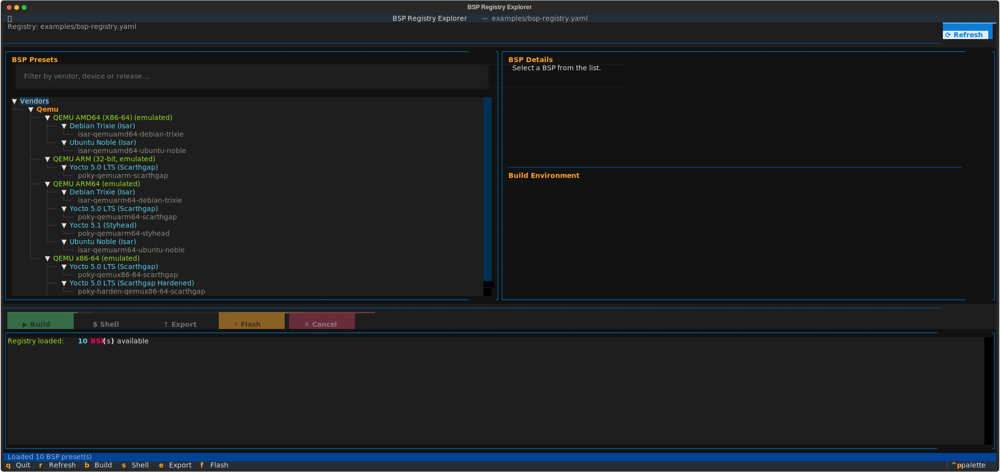
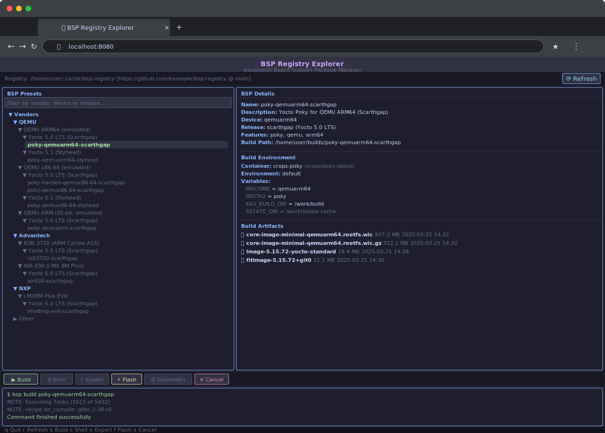

# bsp-registry-tools

Python tools to build, fetch, and work with Yocto-based BSPs using the [KAS](https://kas.readthedocs.io/) build system.

## Overview

`bsp-registry-tools` provides a command-line interface, an interactive GUI launcher, and a Python API for managing Advantech Board Support Packages (BSPs). It uses YAML-based registry files to define BSP configurations, build environments, and Docker containers, making reproducible Yocto builds straightforward.

### Key Features

- 📋 **BSP registry management** via YAML configuration files
- 🌐 **Automatic remote registry fetching** — clone/update a remote registry with no manual setup
- 🐳 **Docker container support** for reproducible build environments
- 🔧 **KAS integration** for Yocto-based builds (`kas`, `kas-container`)
- 🖥️ **Interactive shell** access to build environments
- 🔄 **Environment variable expansion** (`$ENV{VAR}` syntax)
- 📤 **Configuration export** for sharing and archiving build configs
- ✅ **Comprehensive validation** of configurations before building
- 📂 **Registry splitting** — compose a registry from multiple files using the `include` directive
- 🌍 **HTTP server mode** — expose the full BSP registry via REST and GraphQL APIs
- ☁️ **Cloud artifact deployment** — upload Yocto build artifacts to Azure Blob Storage or AWS S3 with `bsp deploy`
- 🚀 **Interactive TUI launcher** (`bsp-explorer`) — visual alternative to the CLI
- 🧪 **HIL test triggering** — submit [LAVA](https://lava.readthedocs.io/) test jobs with Robot Framework suites after a build

## Installation

### From PyPI

```bash
pip install bsp-registry-tools
```

To also install the optional HTTP server dependencies:

```bash
pip install "bsp-registry-tools[server]"
```

### With GUI support

```bash
pip install 'bsp-registry-tools[gui]
```

### From Source

```bash
git clone https://github.com/Advantech-EECC/bsp-registry-tools.git
cd bsp-registry-tools
pip install .

# With server extras:
pip install ".[server]"
```

### Dependencies

- Python 3.8+
- [PyYAML](https://pyyaml.org/) >= 6.0
- [dacite](https://github.com/konradhalas/dacite) >= 1.6.0
- [kas](https://kas.readthedocs.io/) >= 4.7
- [colorama](https://github.com/tartley/colorama) >= 0.4.6
- *(optional)* [textual](https://textual.textualize.io/) >= 8.0.0 — required for `bsp-explorer` GUI
- [requests](https://requests.readthedocs.io/) >= 2.28.0 *(for LAVA HIL test integration)*
- [Jinja2](https://jinja.palletsprojects.com/) >= 3.1.0 *(for LAVA job template rendering)*

**Optional — server mode** (`pip install bsp-registry-tools[server]`):

- [FastAPI](https://fastapi.tiangolo.com/) >= 0.100.0
- [uvicorn](https://www.uvicorn.org/) >= 0.23.0
- [strawberry-graphql](https://strawberry.rocks/) >= 0.200.0
#### Optional extras for cloud deployment

Cloud SDK dependencies are optional and only needed if you use `bsp deploy`:

```bash
# Azure Blob Storage support
pip install "bsp-registry-tools[azure]"

# AWS S3 support
pip install "bsp-registry-tools[aws]"

# Both providers
pip install "bsp-registry-tools[deploy]"
```

## Quick Start

### Zero-Config Usage (Remote Registry)

If you have no local registry file, `bsp` automatically clones the default
[Advantech BSP registry](https://github.com/Advantech-EECC/bsp-registry) into
`~/.cache/bsp/registry` and keeps it up-to-date on every run:

```bash
# First run: clones the registry, then lists BSPs
bsp list

# Subsequent runs: pulls latest changes, then lists BSPs
bsp list

# Skip the network update (useful offline or in CI)
bsp --no-update list

# Use a different remote or branch
bsp --remote https://github.com/my-org/bsp-registry.git --branch dev list
```

### Manual Registry Usage

### 1. Create a BSP Registry File

Create a `bsp-registry.yaml` or `bsp-registry.yml` file (see [examples/bsp-registry.yaml](examples/bsp-registry.yaml)):

```yaml
specification:
  version: "2.0"

environment:
  variables:
    - name: "GITCONFIG_FILE"
      value: "$ENV{HOME}/.gitconfig"

# Named environment: container + variables used for all builds by default
environments:
  default:
    container: "debian-bookworm"
    variables:
      - name: "DL_DIR"
        value: "$ENV{HOME}/yocto-cache/downloads"
      - name: "SSTATE_DIR"
        value: "$ENV{HOME}/yocto-cache/sstate"

containers:
  debian-bookworm:
    image: "bsp/registry/debian/kas:5.1"
    file: Dockerfile
    args:
      - name: "DISTRO"
        value: "debian-bookworm"
      - name: "KAS_VERSION"
        value: "5.1"

registry:
  # frameworks and distro define the build system hierarchy (optional but recommended)
  frameworks:
    - slug: yocto
      description: "Yocto Project build system"
      vendor: "Yocto Project"
      includes:
        - kas/yocto/yocto.yaml

  distro:
    - slug: poky
      description: "Poky (Yocto Project reference distro)"
      framework: yocto     # links distro to a framework for feature compatibility checks
      includes:
        - kas/yocto/distro/poky.yaml

  # devices define hardware targets (KAS includes listed flat, no nested build: block)
  devices:
    - slug: qemuarm64
      description: "QEMU ARM64 (emulated)"
      vendor: qemu
      soc_vendor: arm
      includes:
        - kas/qemu/qemuarm64.yaml

  releases:
    - slug: scarthgap
      description: "Yocto 5.0 LTS (Scarthgap)"
      distro: poky
      yocto_version: "5.0"
      includes:
        - kas/scarthgap.yaml

  # bsp presets name a device + release + features combination.
  # Use "releases" (plural) to target multiple releases without repetition:
  bsp:
    - name: poky-qemuarm64
      description: "Poky QEMU ARM64"
      device: qemuarm64
      releases: [scarthgap, styhead]   # expands to poky-qemuarm64-scarthgap / poky-qemuarm64-styhead
      features: []
      build:
        container: "debian-bookworm"
    # Single-release entry (backward compatible):
    - name: poky-qemuarm64-scarthgap-ota
      description: "Poky QEMU ARM64 Scarthgap with OTA"
      device: qemuarm64
      release: scarthgap
      features: [ota]
      build:
        container: "debian-bookworm"
        path: build/poky-qemuarm64-scarthgap-ota
```

### 2. List Available BSPs

```bash
# With an explicit registry file
bsp --registry bsp-registry.yaml list

# Or simply if bsp-registry.yaml (or bsp-registry.yml) is in the current directory
bsp list
```

```
- poky-qemuarm64-scarthgap: Poky QEMU ARM64 Scarthgap (Yocto 5.0 LTS)
```

### 3. Build a BSP

```bash
bsp build poky-qemuarm64-scarthgap
```

### 4. Enter Interactive Shell

```bash
bsp shell poky-qemuarm64-scarthgap
```

### 5. Launch the Interactive GUI

```bash
# Install the GUI extra first
pip install 'bsp-registry-tools[gui]'

# Then launch the TUI launcher
bsp-explorer

# Or via the main CLI
bsp gui
bsp --gui

# Serve the TUI in a browser (Textual web server)
bsp-explorer-web
```

**Terminal** (`bsp-explorer`):



**Browser** (`bsp-explorer-web`):



### 6. Submit a HIL Test Job

```bash
# Submit a LAVA test job for a pre-built image and wait for results
bsp test poky-qemuarm64-scarthgap --wait

# Build and immediately trigger a LAVA test after the build succeeds
bsp build poky-qemuarm64-scarthgap --test --wait
```

## GUI Launcher (`bsp-explorer`)

`bsp-explorer` is a Terminal User Interface (TUI) that provides a visual, interactive
alternative to the CLI — similar in spirit to the
[Advantech BSP Launcher](https://docs.aim-linux.advantech.com/docs/utility/bsplauncher/).


### Features

| Feature | Description |
|---------|-------------|
| **BSP tree** | Vendor → Device → Release → BSP preset hierarchy with filter/search support |
| **BSP details** | Select a BSP to view its description, device, release, features, and build path |
| **Build environment** | Shows the Docker container, named environment, and resolved variables |
| **Build artifacts** | Automatically scans the Yocto deploy directory for `.wic` images and kernel images (`uImage`, `zImage`, `Image`, `fitImage`) — updated after each successful build |
| **Build** | Opens a dialog to choose build options (clean, checkout-only), then streams output to the log (`b`). Output is saved to a timestamped log file (`bsp-build-YYYYMMDD-HHMMSS.log`) in the build folder |
| **Shell** | Exits the TUI and launches an interactive `bsp shell` session in the restored terminal (`s`) |
| **Flash** | Auto-discovers removable drives (USB, SD card, eMMC), selects a flash image, then writes it to the target device using `bmaptool` or `dd` (`f`) |
| **Deploy** | Uploads build artifacts to cloud storage (Azure/AWS) when artifacts are available (`d`) |
| **Export** | Export KAS configuration and stream output to the log panel (`e`) |
| **Cancel** | Terminates a running build (kills the entire process group) (`x`) |
| **Refresh** | Reload the registry (pull latest from remote if applicable) (`r`) |
| **Output log** | Real-time streaming of command output in a scrollable panel |
| **Keyboard-first** | Full keyboard navigation; footer shows all available shortcuts |
| **Registry info** | Top bar displays the active registry URL and branch |

### Launching options

```bash
# Use the default (remote) registry
bsp-explorer

# Use a local registry file
bsp-explorer --registry ./bsp-registry.yaml

# Use a custom remote registry
bsp-explorer --remote https://github.com/my-org/bsp-registry.git --branch dev

# Skip the remote update (faster, offline)
bsp-explorer --no-update

# Serve the TUI in a web browser (requires Textual's web extra)
bsp-explorer-web
```

**TUI in terminal** (`bsp-explorer`):


**TUI in browser** (`bsp-explorer-web`):


### CLI vs GUI comparison

| Capability | CLI (`bsp`) | GUI (`bsp-explorer`) |
|-----------|-------------|----------------------|
| List BSPs | `bsp list` | Visual table, keyboard-navigable |
| Build BSP | `bsp build <name>` | Select row → press `b` |
| Shell access | `bsp shell <name>` | Shows equivalent CLI command |
| Export config | `bsp export <name>` | Select row → press `e` |
| List containers | `bsp containers` | Press `c` |
| Real-time output | stdout/stderr | Integrated scrollable log panel |
| Scriptable / CI | ✅ Yes | ❌ Requires a terminal |
## CLI Reference

```
usage: bsp [-h] [--verbose] [--registry REGISTRY] [--no-color]
           [--remote REMOTE] [--branch BRANCH] [--update | --no-update]
           [--local] [--gui]
           {gui,build,list,containers,tree,export,shell,server,deploy,gather,test,flash} ...

Advantech Board Support Package Registry

positional arguments:
  {gui,build,list,containers,tree,export,shell,server,deploy,gather,test,flash}
                        Command to execute
    gui                 Launch the interactive GUI launcher
    build               Build an image for BSP
    list                List available BSPs
    containers          List available containers
    tree                Display a tree view of the BSP registry
    export              Export BSP configuration
    shell               Enter interactive shell for BSP
    server              Start a GraphQL / REST HTTP server
    deploy              Deploy build artifacts to cloud storage
    gather              Download BSP build artifacts from cloud storage
    test                Submit a LAVA HIL test job for a BSP
    flash               Flash a build image to a block device (SD card / eMMC)

options:
  -h, --help            show this help message and exit
  --verbose, -v         Verbose output
  --registry REGISTRY, -r REGISTRY
                        BSP Registry file (local path; skips remote fetch)
  --no-color            Disable colored output
  --remote REMOTE       Remote registry git URL
                        (default: https://github.com/Advantech-EECC/bsp-registry.git)
  --branch BRANCH       Remote registry branch (default: main)
  --update              Update the cached registry clone before use (default)
  --no-update           Skip updating the cached registry clone
  --local               Force local registry lookup only (do not use remote)
  --gui                 Launch the interactive GUI (requires the [gui] extra)
```

### Registry Resolution Priority

The tool determines which registry file to use in the following order:

1. **`--registry <path>`** — explicit local file, remote fetch is skipped entirely.
2. **`--local`** — use `./bsp-registry.yaml` or `./bsp-registry.yml` in the current directory; no network access.
3. **`bsp-registry.yaml` exists in the current directory** — auto-detect (preferred extension).
4. **`bsp-registry.yml` exists in the current directory** — auto-detect (alternate extension).
5. **Otherwise** — clone/update the remote registry into `~/.cache/bsp/registry` via `RegistryFetcher`.

### Global Options

| Option | Description |
|--------|-------------|
| `--verbose`, `-v` | Enable verbose/debug output |
| `--registry REGISTRY`, `-r REGISTRY` | Path to BSP registry file (local override) |
| `--no-color` | Disable colored output |
| `--remote REMOTE` | Remote registry git URL (default: Advantech BSP registry) |
| `--branch BRANCH` | Remote registry branch (default: `main`) |
| `--update` / `--no-update` | Update cached registry clone before use (default: update) |
| `--local` | Force local lookup; never contact remote |

### Commands

#### `list` — List available BSPs

```bash
bsp list
bsp --registry my-registry.yaml list
```

#### `containers` — List available container definitions

```bash
bsp containers
```

#### `tree` — Display a tree view of the BSP registry

```bash
bsp tree
bsp tree --full
bsp tree --compact
bsp --no-color tree
bsp --registry my-registry.yaml tree
```

Renders the full registry as a colored ASCII tree, grouped into sections:
**Frameworks**, **Distros**, **Releases** (with vendor overrides), **Devices**,
**Features** (with release and vendor overrides in full mode), and **BSP Presets** (with device, release, and feature details).
Use `--no-color` to disable colors (e.g. for scripts or log files).

| Option | Description |
|--------|-------------|
| `--full` | Show full details including includes lists, release overrides and vendor overrides for features, vendor overrides for releases, and override slugs for presets |
| `--compact` | Show compact output with names/slugs only (no sub-items) |

**Example output (`bsp tree`):**

```
BSP Registry
├── Frameworks (1)
│   └── yocto: Yocto Project (vendor: yocto)
├── Distros (1)
│   └── poky: Poky (vendor: yocto, framework: yocto)
├── Releases (1)
│   └── scarthgap: Yocto 5.0 LTS [Yocto 5.0]
│       ├── distro: poky
│       └── vendor override: advantech (sub-releases: imx-6.6.53)
├── Devices (2)
│   ├── qemu-arm64: QEMU ARM64 (vendor: qemu, soc_vendor: arm)
│   └── imx8qm: i.MX8 QM (vendor: advantech, soc_vendor: nxp, soc_family: imx8)
├── Features (2)
│   ├── ota: OTA Update
│   └── secure-boot: Secure Boot [requires vendor: ['advantech']]
└── BSP Presets (2)
    ├── qemu-arm64-scarthgap: QEMU ARM64 Scarthgap
    │   └── device: qemu-arm64  release: scarthgap
    └── imx8qm-scarthgap: i.MX8 QM Scarthgap
        ├── device: imx8qm  release: scarthgap
        ├── vendor release: imx-6.6.53
        └── features: ota, secure-boot
```

**Example output (`bsp tree --full`):**

In `--full` mode all includes lists are expanded, release overrides and vendor overrides for features are shown as nested sub-trees, and vendor overrides for releases are also expanded:

```
BSP Registry
├── Releases (1)
│   └── scarthgap: Yocto 5.0 LTS [Yocto 5.0]
│       ├── distro: poky
│       ├── includes: kas/poky/scarthgap.yaml
│       └── vendor override: advantech (distro: fsl-imx-xwayland)
│           ├── includes: kas/yocto/vendors/advantech/scarthgap.yaml
│           └── vendor release: imx-6.6.53: Scarthgap for i.MX 6.6.53
│               └── includes:
│                   └── kas/yocto/vendors/advantech/nxp/imx-6.6.53.yaml
└── Features (1)
    └── ostree: Enable OSTree support in the Yocto image [requires compatible_with: yocto]
        ├── includes:
        │   └── features/ota/ostree/ostree.yml
        ├── release override: scarthgap
        │   └── includes:
        │       └── features/ota/ostree/ostree-scarthgap.yml
        ├── release override: styhead
        │   └── includes:
        │       └── features/ota/ostree/ostree-styhead.yml
        └── vendor override: advantech
            └── soc vendor: nxp
                └── includes: features/ota/ostree/modular-bsp-ota-nxp.yml
```

#### `build` — Build a BSP image

```bash
bsp build <bsp_name> [--clean] [--checkout] [--target TARGET] [--task TASK] [--path PATH]
bsp build <bsp_name> [--deploy] [--deploy-provider PROVIDER] [--deploy-container CONTAINER] [--deploy-prefix PREFIX]
bsp build <bsp_name> [--test [--wait] [--lava-server URL] [--lava-token TOKEN] [--artifact-url URL]]
bsp build --device <device> --release <release> [--feature FEATURE...] [--checkout] [--target TARGET] [--task TASK] [--path PATH] [--test ...]
```

| Option | Description |
|--------|-------------|
| `--clean` | Clean build directory before building |
| `--checkout` | Validate configuration and checkout repos without building |
| `--path PATH` | Override the output build directory path defined in the registry |
| `--target TARGET` | Bitbake build target (image or recipe) to pass to KAS, overriding any targets defined in the registry preset |
| `--task TASK` | Bitbake task to run (e.g. `compile`, `configure`) to pass to KAS |
| `--deploy` | Deploy artifacts to cloud storage after a successful build |
| `--deploy-provider PROVIDER` | Cloud storage provider: `azure` (default) or `aws` |
| `--deploy-container CONTAINER` | Azure container or AWS bucket name (overrides registry config) |
| `--deploy-prefix PREFIX` | Remote path prefix template (overrides registry config) |
| `--deploy-archive-name NAME` | Bundle artifacts into a single archive with this name before uploading (supports `{device}`, `{release}`, `{distro}`, `{vendor}`, `{date}`, `{datetime}`) |
| `--deploy-archive-format FORMAT` | Archive format: `tar.gz` (default), `tar.bz2`, `tar.xz`, `zip` |
| `--test` | Submit a LAVA HIL test job after a successful build |
| `--wait` | Wait for the LAVA job to complete and print results (requires `--test`) |
| `--lava-server URL` | LAVA server base URL override (overrides registry `lava.server`) |
| `--lava-token TOKEN` | LAVA API token override (overrides registry `lava.token`) |
| `--artifact-url URL` | Base URL where build artifacts are served to the LAVA lab |

**Examples:**

```bash
# Full build
bsp build poky-qemuarm64-scarthgap

# Checkout/validate only (fast, no build)
bsp build poky-qemuarm64-scarthgap --checkout

# Override the output build directory
bsp build poky-qemuarm64-scarthgap --path /mnt/fast-ssd/build

# Build a specific Bitbake image (overrides registry-configured targets)
bsp build poky-qemuarm64-scarthgap --target core-image-minimal

# Build a specific image and run only the compile task
bsp build poky-qemuarm64-scarthgap --target core-image-minimal --task compile

# Build and deploy artifacts to Azure automatically
bsp build poky-qemuarm64-scarthgap --deploy

# Build and deploy to a specific AWS bucket
bsp build poky-qemuarm64-scarthgap --deploy --deploy-provider aws --deploy-container my-s3-bucket

# Build and trigger LAVA test, wait for result
bsp build poky-qemuarm64-scarthgap --test --wait

# Build with LAVA credential overrides
bsp build poky-qemuarm64-scarthgap --test --wait \
  --lava-server https://lava.ci.example.com \
  --lava-token $LAVA_TOKEN \
  --artifact-url http://files.example.com/builds
```

When a build is triggered via the `bsp-explorer` GUI, the full output is saved to a timestamped log file inside the BSP's build directory (e.g. `build/poky-qemuarm64-scarthgap/bsp-build-20260406-205840.log`). Each build creates a new log file, so previous build logs are preserved.

#### `shell` — Interactive shell in build environment

```bash
bsp shell <bsp_name> [--command COMMAND]
```

| Option | Description |
|--------|-------------|
| `--command COMMAND`, `-c COMMAND` | Execute a specific command instead of starting interactive shell |

**Examples:**

```bash
# Interactive shell
bsp shell poky-qemuarm64-scarthgap

# Execute single command
bsp shell poky-qemuarm64-scarthgap --command "bitbake core-image-minimal"
```

#### `export` — Export BSP configuration

```bash
bsp export <bsp_name> [--output OUTPUT]
bsp export --device <device> --release <release> [--feature FEATURE...] [--output OUTPUT]
```

| Option | Description |
|--------|-------------|
| `--output OUTPUT`, `-o OUTPUT` | Output file path (default: stdout) |

**Examples:**

```bash
# Print to stdout
bsp export poky-qemuarm64-scarthgap

# Save to file
bsp export poky-qemuarm64-scarthgap --output exported-config.yaml
```

#### `server` — Start an HTTP server (REST + GraphQL)

Starts a FastAPI-based HTTP server that exposes the full BSP registry via both a REST API and a GraphQL API.  Requires the `server` optional extras (`pip install "bsp-registry-tools[server]"`).

```bash
bsp server [--host HOST] [--port PORT] [--reload]
```

| Option | Default | Description |
|--------|---------|-------------|
| `--host HOST` | `127.0.0.1` | Host address to bind to |
| `--port PORT` | `8080` | Port to listen on |
| `--reload` | — | Enable auto-reload on code changes (development mode) |
#### `deploy` — Upload build artifacts to cloud storage

Deploy Yocto build artifacts (images, SDKs) that were produced by `bsp build`
to Azure Blob Storage or AWS S3.

```bash
bsp deploy <bsp_name> [OPTIONS]
bsp deploy --device <d> --release <r> [--feature <f>] [OPTIONS]
#### `flash` — Flash a build image to a block device

Writes the most recently built `.wic` (or `.img`) image from the BSP's deploy directory to an SD card or eMMC target. Uses `bmaptool` for efficient sparse writes when a `.bmap` sidecar is present, or falls back to `dd`.

```bash
bsp flash <bsp_name> --target <device> [--image <path>]
```

| Option | Description |
|--------|-------------|
| `--provider PROVIDER` | Storage provider: `azure` (default) or `aws` |
| `--container CONTAINER`, `--bucket CONTAINER` | Azure container or AWS S3 bucket name |
| `--prefix PREFIX` | Remote path prefix template (supports `{device}`, `{release}`, `{distro}`, `{vendor}`, `{date}`, `{datetime}`) |
| `--pattern PATTERN` | Glob pattern for artifacts to upload (repeatable; overrides registry config) |
| `--archive-name NAME` | Bundle artifacts into a single archive with this name before uploading (supports `{device}`, `{release}`, `{distro}`, `{vendor}`, `{date}`, `{datetime}`) |
| `--archive-format FORMAT` | Archive format: `tar.gz` (default), `tar.bz2`, `tar.xz`, `zip` |
| `--dry-run` | List what would be uploaded without uploading (no credentials required) |
| `--target TARGET`, `-t TARGET` | Target block device (e.g. `/dev/sda`, `/dev/mmcblk0`) |
| `--image IMAGE`, `-i IMAGE` | Path to the image file to flash (auto-selected from deploy dir if omitted) |

---

#### `test` — Submit a LAVA HIL test job

Submits a LAVA job for hardware-in-the-loop testing.  By default the job is submitted and the URL is printed; use `--wait` to block until it completes.

```bash
bsp test <bsp_name> [--wait] [--lava-server URL] [--lava-token TOKEN] [--artifact-url URL]
bsp test --device <device> --release <release> [--feature FEATURE...] [--wait] ...
```

| Option | Description |
|--------|-------------|
| `--wait` | Block until the LAVA job completes and print per-suite results |
| `--lava-server URL` | LAVA server base URL (overrides registry `lava.server`) |
| `--lava-token TOKEN` | LAVA API authentication token (overrides registry `lava.token`) |
| `--artifact-url URL` | Base URL where built image artifacts are accessible to the LAVA lab |

**Examples:**

```bash
# Submit a LAVA job for a pre-built image and exit immediately
bsp test poky-qemuarm64-scarthgap

# Submit and wait for the job to complete
bsp test poky-qemuarm64-scarthgap --wait

# Override LAVA settings from the CLI
bsp test poky-qemuarm64-scarthgap --wait \
  --lava-server https://lava.ci.example.com \
  --lava-token $LAVA_TOKEN \
  --artifact-url http://minio.example.com/builds

# Component-based (no preset needed)
bsp test --device qemuarm64 --release scarthgap --wait
```
Once started, the following interfaces are available:

| URL | Description |
|-----|-------------|
| `http://localhost:8080/docs` | Swagger / OpenAPI UI (REST) |
| `http://localhost:8080/redoc` | ReDoc UI (REST) |
| `http://localhost:8080/graphql` | GraphiQL interactive editor (GraphQL) |
| `http://localhost:8080/api/v1/…` | REST API endpoints |

## HTTP Server (REST + GraphQL)

The `bsp server` command exposes the entire BSP registry over HTTP.  Both a REST API and a GraphQL API are available simultaneously on the same port.

### Installation

```bash
pip install "bsp-registry-tools[server]"
```

### Starting the server

```bash
# Default: http://127.0.0.1:8080
bsp server

# Custom host/port
bsp server --host 0.0.0.0 --port 9000

# Using a specific registry file
bsp --registry /path/to/bsp-registry.yaml server --host 0.0.0.0 --port 8080
```

### REST API (`/api/v1/`)

#### Query endpoints (GET)

| Method | Path | Description |
|--------|------|-------------|
| GET | `/api/v1/bsp` | List all BSP presets |
| GET | `/api/v1/devices` | List all hardware devices |
| GET | `/api/v1/releases` | List all releases |
| GET | `/api/v1/releases?device=<slug>` | List releases compatible with a device |
| GET | `/api/v1/features` | List all optional features |
| GET | `/api/v1/distros` | List all distribution definitions |
| GET | `/api/v1/frameworks` | List all framework definitions |
| GET | `/api/v1/containers` | List all Docker container definitions |

**Example:**

```bash
curl http://localhost:8080/api/v1/devices
```

```json
[
  {
    "slug": "qemuarm64",
    "description": "QEMU ARM64 (emulated)",
    "vendor": "qemu",
    "soc_vendor": "arm",
    "soc_family": null,
    "includes": ["kas/qemu/qemuarm64.yaml"],
    "local_conf": []
  }
]
```

#### Action endpoints (POST)

| Method | Path | Description |
|--------|------|-------------|
| POST | `/api/v1/export` | Resolve and return a BSP config as YAML |
| POST | `/api/v1/build` | Trigger a BSP build (blocking) |
| POST | `/api/v1/shell` | Run a command inside the build container |

All action endpoints accept a JSON body with either `bsp_name` **or** both `device` + `release`:

```bash
# Export by preset name
curl -X POST http://localhost:8080/api/v1/export \
     -H "Content-Type: application/json" \
     -d '{"bsp_name": "poky-qemuarm64-scarthgap"}'

# Export by components
curl -X POST http://localhost:8080/api/v1/export \
     -H "Content-Type: application/json" \
     -d '{"device": "qemuarm64", "release": "scarthgap", "features": []}'

# Validate (checkout only) without building
curl -X POST http://localhost:8080/api/v1/build \
     -H "Content-Type: application/json" \
     -d '{"bsp_name": "poky-qemuarm64-scarthgap", "checkout_only": true}'
```

#### Interactive REST documentation

Navigate to **`http://localhost:8080/docs`** for the full Swagger / OpenAPI UI or **`http://localhost:8080/redoc`** for ReDoc.

### GraphQL API (`/graphql`)

Navigate to **`http://localhost:8080/graphql`** for the interactive GraphiQL editor.

#### Queries

```graphql
# List all devices
{ devices { slug description vendor socVendor } }

# List all BSP presets
{ bsp { name description device release features } }

# List releases compatible with a specific device
{ releases(device: "qemuarm64") { slug description yoctoVersion } }

# List features, distros, frameworks, and containers
{ features { slug description compatibleWith }
  distros { slug description framework }
  frameworks { slug vendor }
  containers { name image } }
```

#### Mutations

```graphql
# Export BSP config by preset name
mutation {
  exportBsp(bspName: "poky-qemuarm64-scarthgap") {
    yamlContent
  }
}

# Export by components
mutation {
  exportBsp(device: "qemuarm64", release: "scarthgap") {
    yamlContent
  }
}

# Validate (checkout only) without building
mutation {
  buildBsp(bspName: "poky-qemuarm64-scarthgap", checkoutOnly: true) {
    status
    message
  }
}

# Run a command in the build container
mutation {
  shellCommand(bspName: "poky-qemuarm64-scarthgap", command: "bitbake -e") {
    returnCode
    output
  }
}
```

### Python API — embedding the server

You can also embed the server directly in Python code:

```python
import uvicorn
from bsp.server import create_app

app = create_app(registry_path="/path/to/bsp-registry.yaml")
uvicorn.run(app, host="0.0.0.0", port=8080)
```

Or reuse an already-initialised `BspManager`:

```python
from bsp import BspManager
from bsp.server import create_app
import uvicorn

manager = BspManager("bsp-registry.yaml")
manager.initialize()

app = create_app(manager=manager)
uvicorn.run(app, host="0.0.0.0", port=8080)
```

---

```bash
# Submit a LAVA job for a pre-built image and exit immediately
bsp test poky-qemuarm64-scarthgap

# Submit and wait for the job to complete
bsp test poky-qemuarm64-scarthgap --wait

# Override LAVA settings from the CLI
bsp test poky-qemuarm64-scarthgap --wait \
  --lava-server https://lava.ci.example.com \
  --lava-token $LAVA_TOKEN \
  --artifact-url http://minio.example.com/builds

# Component-based (no preset needed)
bsp test --device qemuarm64 --release scarthgap --wait
```

**Example output (`bsp test poky-qemuarm64-scarthgap --wait`):**

```
LAVA Job ID: 1042
Job URL:     https://lava.example.com/scheduler/job/1042

LAVA Job 1042 — Health: Complete

Test Results:
  ✓ Suite: smoke                           PASS  (3/3 passed)
  ✓ Suite: boot                            PASS  (5/5 passed)
  ✗ Suite: network                         FAIL  (2/3 passed)
```

## HIL Testing with LAVA and Robot Framework

`bsp-registry-tools` can submit Hardware-in-the-Loop (HIL) test jobs to a
[LAVA](https://lava.readthedocs.io/) server after or independently of a build.
Test jobs are rendered from a Jinja2 template and can run
[Robot Framework](https://robotframework.org/) suites inside the LAVA pipeline.

### Configuration overview

LAVA settings live in two places:

1. **Registry-level `lava:` block** — shared server settings (URL, token, timeouts).
   All values support `$ENV{}` expansion so credentials are never hardcoded.
2. **Per-preset `testing.lava:` block** — device type, artifact URL, LAVA tags,
   custom job template, and Robot Framework suites.

CLI flags (`--lava-server`, `--lava-token`, `--artifact-url`) override both.

### Minimal example

```yaml
# bsp-registry.yaml

specification:
  version: "2.0"

# Registry-level LAVA connection settings
lava:
  server: "$ENV{LAVA_SERVER}"      # e.g. https://lava.example.com
  token: "$ENV{LAVA_TOKEN}"        # LAVA API authentication token
  username: "$ENV{LAVA_USER}"      # LAVA username (optional)
  wait_timeout: 3600               # max seconds to wait for a job (default: 1 h)
  poll_interval: 30                # polling interval in seconds

registry:
  devices:
    - slug: qemuarm64
      description: "QEMU ARM64"
      vendor: qemu
      soc_vendor: arm
      includes:
        - kas/qemu/qemuarm64.yaml

  releases:
    - slug: scarthgap
      description: "Yocto 5.0 LTS"
      distro: poky
      includes:
        - kas/scarthgap.yaml

  bsp:
    - name: poky-qemuarm64-scarthgap
      description: "Poky QEMU ARM64 Scarthgap"
      device: qemuarm64
      release: scarthgap
      build:
        container: debian-bookworm
        path: build/poky/qemuarm64/scarthgap
      # HIL test configuration
      testing:
        lava:
          device_type: "qemu-aarch64"          # LAVA device type label
          artifact_url: "http://files.ci/builds" # where the image is served
          tags: ["hil", "qemu"]                # optional LAVA scheduler tags
          job_template: "kas/lava/qemu.yaml.j2" # optional; builtin used if omitted
          robot:
            suites:
              - tests/robot/smoke.robot
              - tests/robot/boot.robot
            variables:
              BOARD_IP: "10.0.0.5"
              SSH_PORT: "22"
```

### LAVA job templates

When `job_template` is omitted a built-in minimal template is used (QEMU boot +
optional Robot Framework test action).  For real devices, create a Jinja2
template and point `job_template` at it.

A fully annotated example is provided at
[`examples/lava/job-template.yaml.j2`](examples/lava/job-template.yaml.j2).

**Available Jinja2 context variables:**

| Variable | Description |
|----------|-------------|
| `device_type` | LAVA device type label |
| `job_name` | Auto-composed from device/release/feature slugs |
| `image_url` | Full artifact URL (`artifact_url` + `build_path`) |
| `artifact_url` | Base artifact URL |
| `build_path` | Relative build output directory |
| `device_slug` | Device slug (e.g. `qemuarm64`) |
| `release_slug` | Release slug (e.g. `scarthgap`) |
| `feature_slugs` | List of active feature slugs |
| `lava_tags` | List of LAVA scheduler tags |
| `robot_suites` | List of Robot Framework `.robot` file paths |
| `robot_variables` | Dict of Robot Framework `--variable` pairs |
| `timeout_minutes` | Overall job timeout in minutes |

### Workflow examples

```bash
# Submit a LAVA job after a successful build and wait for results
bsp build poky-qemuarm64-scarthgap --test --wait

# Submit a LAVA test job for an already-built image
bsp test poky-qemuarm64-scarthgap --wait

# Override LAVA settings at the command line (useful in CI)
export LAVA_SERVER=https://lava.ci.example.com
export LAVA_TOKEN=mytoken
bsp test poky-qemuarm64-scarthgap \
  --artifact-url http://minio.example.com/builds \
  --wait

# Component-based test (no preset required)
bsp test --device qemuarm64 --release scarthgap \
  --lava-server https://lava.ci.example.com \
  --lava-token $LAVA_TOKEN \
  --wait
```

### Python API

```python
from bsp import BspManager, LavaClient, LavaTestSuite, build_lava_job


manager = BspManager("bsp-registry.yaml")
manager.initialize()

app = create_app(manager=manager)
uvicorn.run(app, host="0.0.0.0", port=8080)
```
# Deploy using registry-configured settings (Azure by default)
bsp deploy poky-qemuarm64-scarthgap

# Preview what would be uploaded without uploading
bsp deploy poky-qemuarm64-scarthgap --dry-run

# Deploy to an explicit Azure container
bsp deploy poky-qemuarm64-scarthgap --container bsp-artifacts

# Deploy to AWS S3
bsp deploy poky-qemuarm64-scarthgap --provider aws --bucket my-s3-bucket

# Deploy by components with a custom prefix
bsp deploy --device qemuarm64 --release scarthgap --prefix "builds/{vendor}/{device}/{date}"

# Upload only compressed image files
bsp deploy poky-qemuarm64-scarthgap --pattern "**/*.wic.gz"
```

**Authentication:**

| Provider | Authentication |
|----------|---------------|
| Azure | `AZURE_STORAGE_CONNECTION_STRING` env var, or `AZURE_STORAGE_ACCOUNT_URL` + `DefaultAzureCredential` (supports `az login`, service principal env vars, Managed Identity) |
| AWS | Standard boto3 credential chain: `~/.aws/credentials`, `AWS_ACCESS_KEY_ID`/`AWS_SECRET_ACCESS_KEY` env vars, IAM role, instance profile |

See [docs/artifact-deployment.md](docs/artifact-deployment.md) for full details, YAML configuration, and CI/CD integration examples.
# Submit LAVA test and wait for results
passed = manager.test_bsp(
    "poky-qemuarm64-scarthgap",
    lava_server="https://lava.example.com",
    lava_token="mytoken",
    artifact_url="http://files.example.com/builds",
    wait=True,
)

# Use LavaClient directly
client = LavaClient(server="https://lava.example.com", token="mytoken")
job_id = client.submit_job(job_yaml_string)
health = client.wait_for_job(job_id, timeout=3600, poll_interval=30)
suites: list[LavaTestSuite] = client.get_job_results(job_id)
```


# Flash to USB drive (auto-selects the latest .wic image)
bsp flash poky-qemuarm64-scarthgap --target /dev/sda

# Flash a specific image file
bsp flash poky-qemuarm64-scarthgap --target /dev/mmcblk0 --image path/to/image.wic
```

## Registry Configuration Reference

The BSP registry is a YAML file following **schema v2.0**.  See [docs/registry-v2.md](docs/registry-v2.md) for the full reference.  For the HTTP server reference, see [docs/server.md](docs/server.md).  Key top-level sections:

### `specification`

```yaml
specification:
  version: "2.0"
```

### `include` (optional)

Split a large registry across multiple files using the `include` directive.
Paths are relative to the file that contains the directive.

```yaml
include:
  - devices/boards.yaml
  - releases/scarthgap.yaml
```

Each included file is merged before the root file's own content.  Lists
(e.g. `devices`, `releases`, `features`, `environment`) are concatenated; dicts
(e.g. `containers`, `environments`) are merged recursively; scalars use the root
file's value.
Included files can themselves contain further `include` directives, and
circular references are detected at load time.

See [docs/registry-v2.md](docs/registry-v2.md#include-optional) for full details.

### `environment`

Global build environment applied to all builds.  Groups `variables` (supports `$ENV{VAR_NAME}` expansion) and `copy` (file-copy entries executed inside the build environment before every build) under a single key.

```yaml
environment:
  variables:
    - name: "GITCONFIG_FILE"
      value: "$ENV{HOME}/.gitconfig"
    - name: "DL_DIR"
      value: "$ENV{HOME}/yocto-cache/downloads"
    - name: "SSTATE_DIR"
      value: "$ENV{HOME}/yocto-cache/sstate"
  copy:
    - scripts/global-setup.sh: build/
    - config/global.conf: build/conf/
```

Both `variables` and `copy` are optional.  Global copies are merged first, before named-environment and device copies.

### `environments`

Named environments bundle a container reference, environment variables, and optional file-copy entries together.  The special name `"default"` is used by any release that does not explicitly name an environment.

```yaml
environments:
  default:
    container: "debian-bookworm"
    variables:
      - name: "DL_DIR"
        value: "$ENV{HOME}/yocto-cache/downloads"
  isar-build:
    container: "isar-debian-trixie"
    variables:
      - name: "DL_DIR"
        value: "$ENV{HOME}/isar-cache/downloads"
    # Copy the QEMU run script into every Isar build directory
    copy:
      - isar/scripts/isar-runqemu.sh: build/
```

### `containers`

Docker container definitions for build environments:

```yaml
containers:
  debian-bookworm:
    image: "my-registry/debian/kas:5.1"
    file: Dockerfile
    args:
      - name: "DISTRO"
        value: "debian-bookworm"
      - name: "KAS_VERSION"
        value: "5.1"
  isar-container:
    image: "my-registry/isar/kas:5.1"
    file: Dockerfile.isar
    args: []
    privileged: true    # Run container in privileged mode (required for ISAR builds)
    runtime_args: "-p 2222:2222"  # Extra flags passed to the container engine
```

**Container fields:**

| Field | Type | Default | Description |
|-------|------|---------|-------------|
| `image` | string | — | Docker image name/tag |
| `file` | string | — | Path to Dockerfile for building the image |
| `args` | list | `[]` | Docker build arguments (`name`/`value` pairs) |
| `privileged` | boolean | `false` | Run container with elevated privileges. Required for ISAR builds. |
| `runtime_args` | string | — | Extra flags appended to the container engine `run` invocation (e.g. port-forwarding, `--device` access). Forwarded via `KAS_CONTAINER_ARGS`. |

### `registry.devices`

Hardware device/board definitions:

```yaml
registry:
  devices:
    - slug: qemuarm64
      description: "QEMU ARM64 (emulated)"
      vendor: qemu
      soc_vendor: arm
      includes:
        - kas/qemu/qemuarm64.yaml
```

### `registry.releases`

Yocto/Isar release definitions referencing a distro:

```yaml
registry:
  releases:
    - slug: scarthgap
      description: "Yocto 5.0 LTS (Scarthgap)"
      distro: poky
      yocto_version: "5.0"
      includes:
        - kas/scarthgap.yaml
```

### `registry.features`

Optional feature definitions that can be enabled per-build.  Features declare
their own KAS includes and can restrict themselves to specific frameworks/distros
(`compatible_with`), board vendors (`compatibility`), and/or releases
(`release_overrides`).

```yaml
registry:
  features:
    - slug: ostree
      description: "Enable OSTree support in the Yocto image"
      compatible_with: [yocto]   # restrict to Yocto framework
      includes:
        - features/ota/ostree/ostree.yml   # always included when feature is enabled
      release_overrides:
        - release: scarthgap
          includes:
            - features/ota/ostree/ostree-scarthgap.yml  # only for Scarthgap
        - release: styhead
          includes:
            - features/ota/ostree/ostree-styhead.yml    # only for Styhead
      vendor_overrides:
        - vendor: advantech
          soc_vendors:
            - vendor: nxp
              includes:
                - features/ota/ostree/modular-bsp-ota-nxp.yml  # only for Advantech NXP boards
```

See [docs/registry-v2.md](docs/registry-v2.md#registryfeatures) for the full
reference including `compatibility`, `local_conf`, `env`, and all override fields.

### `registry.bsp`

Named presets — device + release(s) + optional features:

```yaml
registry:
  bsp:
    # Single-release preset (backward compatible)
    - name: poky-qemuarm64-scarthgap
      description: "Poky QEMU ARM64 Scarthgap (Yocto 5.0 LTS)"
      device: qemuarm64
      release: scarthgap
      features: []
      build:              # optional: override container and/or output path
        container: "debian-bookworm"
        path: build/poky-qemuarm64-scarthgap
      testing:            # optional: LAVA HIL test configuration
        lava:
          device_type: "qemu-aarch64"
          artifact_url: "http://files.ci/builds"
          tags: ["hil"]
          job_template: "kas/lava/qemu.yaml.j2"   # optional; builtin used if absent
          robot:
            suites:
              - tests/robot/smoke.robot
            variables:
              BOARD_IP: "10.0.0.5"

    # Multi-release preset: use "releases" (plural) to avoid repeating the
    # same entry for every Yocto release.  The resolver expands this into one
    # preset per release, named "{name}-{release_slug}":
    #   poky-qemuarm64-scarthgap  (auto-composed path: build/poky-qemuarm64-scarthgap)
    #   poky-qemuarm64-styhead    (auto-composed path: build/poky-qemuarm64-styhead)
    # The "testing" block (and "deploy", "local_conf", "targets") is inherited
    # by every expanded preset, so a single testing block covers all releases.
    - name: poky-qemuarm64
      description: "Poky QEMU ARM64"
      device: qemuarm64
      releases: [scarthgap, styhead]
      features: [systemd, debug]
      build:              # optional: container override (path is always auto-composed)
        container: "debian-bookworm"
      testing:            # inherited by poky-qemuarm64-scarthgap AND poky-qemuarm64-styhead
        lava:
          device_type: "qemu-aarch64"
          artifact_url: "http://files.ci/builds"
          tags: ["hil", "qemu"]
          robot:
            suites:
              - tests/robot/smoke.robot
            variables:
              BOARD_IP: "10.0.0.5"
```

> **Note**: `release` (singular) and `releases` (plural) are mutually exclusive.
> Exactly one must be specified per preset entry.  When `releases` is used, all
> non-build fields (`features`, `local_conf`, `targets`, `deploy`, `testing`) are
> inherited unchanged by every expanded preset.  Build paths are computed per
> release as `{build.path or "build/{name}"}-{release_slug}`.  You can therefore
> test every release in the list with a single `testing` block:
>
> ```bash
> bsp test poky-qemuarm64-scarthgap --wait
> bsp test poky-qemuarm64-styhead --wait
> ```

### `deploy` (optional)

Global cloud deployment configuration applied to all builds.  An individual
`BspPreset` can also include a `deploy:` block that overrides specific settings
for that preset (see [Per-preset override](#per-preset-deploy-override) below).

```yaml
deploy:
  provider: azure                                   # "azure" (default) or "aws"
  account_url: $ENV{AZURE_STORAGE_ACCOUNT_URL}      # Azure only; supports $ENV{} expansion
  container: bsp-artifacts                          # Azure container name
  # bucket: my-s3-bucket                           # AWS alternative to container
  prefix: "{vendor}/{device}/{release}/{date}"      # remote path prefix template
  patterns:                                         # glob patterns for files to upload
    - "**/*.wic.gz"
    - "**/*.wic.bz2"
    - "**/*.tar.bz2"
    - "**/*.ext4"
    - "**/*.sdimg"
  artifact_dirs:                                    # subdirs under build_path to search
    - tmp/deploy/images
    - tmp/deploy/sdk
  include_manifest: true                            # upload a JSON manifest of all artifacts
```

**Prefix template variables:**

| Variable | Value |
|----------|-------|
| `{device}` | Device slug |
| `{release}` | Release slug |
| `{distro}` | Effective distro slug |
| `{vendor}` | Device vendor slug |
| `{date}` | Build date in `YYYY-MM-DD` format |
| `{datetime}` | Build datetime in `YYYYMMDD-HHMMSS` format |

#### Per-preset deploy override

Add a `deploy:` block directly on a `BspPreset` to override specific global
deploy settings for that preset.  Only fields that differ from their default
values override the global config; other fields keep the global value.
CLI flags (`--provider`, `--container`, …) are applied last.

```yaml
deploy:                               # global: Azure, shared container
  provider: azure
  account_url: $ENV{AZURE_STORAGE_ACCOUNT_URL}
  container: bsp-artifacts

registry:
  bsp:
    # Uses global settings unchanged.
    - name: qemuarm64-scarthgap
      device: qemuarm64
      release: scarthgap
      features: []

    # Overrides only container and prefix; provider/account_url come from global.
    - name: imx8mp-adv-scarthgap-release
      device: imx8mp-adv
      release: scarthgap
      features: []
      deploy:
        container: imx8mp-release-artifacts         # ← override
        prefix: "release/{device}/{release}/{date}" # ← override
        patterns:
          - "**/*.wic.gz"                           # ← override

    # Switches to AWS entirely for this preset.
    - name: aws-build-scarthgap
      device: qemuarm64
      release: scarthgap
      features: []
      deploy:
        provider: aws                 # ← override: switch provider
        container: my-s3-bucket       # ← override: bucket name
```

See [docs/artifact-deployment.md](docs/artifact-deployment.md) for full details.

### `lava` (optional)

Top-level LAVA server settings shared across all presets.  All values support
`$ENV{}` expansion.

```yaml
lava:
  server: "$ENV{LAVA_SERVER}"   # LAVA server base URL (required for bsp test)
  token: "$ENV{LAVA_TOKEN}"     # API authentication token
  username: "$ENV{LAVA_USER}"   # Username (optional)
  wait_timeout: 3600            # Maximum seconds to wait for a job (default: 3600)
  poll_interval: 30             # Polling interval in seconds (default: 30)
```

**`lava` fields:**

| Field | Type | Default | Description |
|-------|------|---------|-------------|
| `server` | string | — | LAVA server base URL (e.g. `https://lava.example.com`) |
| `token` | string | `""` | LAVA API authentication token |
| `username` | string | `""` | LAVA username |
| `wait_timeout` | integer | `3600` | Maximum wait time in seconds when `--wait` is used |
| `poll_interval` | integer | `30` | Job status polling interval in seconds |


## KAS Configuration Files

KAS configuration files define Yocto layer repositories, machine settings, and build targets. See the [examples/kas/](examples/kas/) directory for reference configurations.

### QEMU Example Configurations

The `examples/` directory contains ready-to-use KAS configurations for QEMU targets:

| File | Description |
|------|-------------|
| `examples/kas/scarthgap.yaml` | Yocto Scarthgap (5.0 LTS) base configuration |
| `examples/kas/styhead.yaml` | Yocto Styhead (5.1) base configuration |
| `examples/kas/qemu/qemuarm64.yaml` | QEMU ARM64 machine configuration |
| `examples/kas/qemu/qemux86-64.yaml` | QEMU x86-64 machine configuration |
| `examples/kas/qemu/qemuarm.yaml` | QEMU ARM (32-bit) machine configuration |

### KAS File Structure

```yaml
header:
  version: 14
  includes:            # Optional: include other KAS files
    - base.yaml

distro: poky
machine: qemuarm64

target:
  - core-image-minimal

repos:
  poky:
    url: "https://git.yoctoproject.org/poky"
    commit: "abc123..."
    path: "layers/poky"
    layers:
      meta:
      meta-poky:

local_conf_header:
  my_config: |
    DISTRO_FEATURES += "x11"
```

## Python API

You can also use `bsp-registry-tools` as a Python library:

```python
from bsp import BspManager, EnvironmentManager, KasManager, RegistryFetcher

# Fetch registry from remote (clone on first call, pull on subsequent)
fetcher = RegistryFetcher()
registry_path = fetcher.fetch_registry(
    repo_url="https://github.com/Advantech-EECC/bsp-registry.git",
    branch="main",
    update=True,
)

# Load and manage BSP registry
manager = BspManager(str(registry_path))
manager.initialize()

# List BSPs programmatically
for bsp in manager.model.registry.bsp:
    print(f"{bsp.name}: {bsp.description}")

# Get a specific BSP
bsp = manager.get_bsp_by_name("poky-qemuarm64-scarthgap")

# Environment variable management with $ENV{} expansion
from bsp import EnvironmentVariable
env_vars = [
    EnvironmentVariable(name="DL_DIR", value="$ENV{HOME}/downloads"),
]
env_manager = EnvironmentManager(env_vars)
print(env_manager.get_value("DL_DIR"))  # Expanded path

# Use KasManager directly
kas = KasManager(
    kas_files=["kas/scarthgap.yaml", "kas/qemu/qemuarm64.yaml"],
    build_dir="build/my-bsp",
    use_container=False,
)
kas.validate_kas_files()
```

### Starting the HTTP server programmatically

```python
import uvicorn
from bsp.server import create_app

# Create and run the server (requires bsp-registry-tools[server])
app = create_app(registry_path="bsp-registry.yaml")
uvicorn.run(app, host="0.0.0.0", port=8080)
### Cloud Deployment API

```python
from bsp import BspManager

manager = BspManager("bsp-registry.yaml")
manager.initialize()

# Deploy artifacts from a preset build (dry-run)
result = manager.deploy_bsp("poky-qemuarm64-scarthgap", dry_run=True)
print(f"Would upload {result.success_count} artifact(s)")

# Deploy with overrides
result = manager.deploy_bsp(
    "poky-qemuarm64-scarthgap",
    deploy_overrides={
        "provider": "aws",
        "container": "my-s3-bucket",
        "prefix": "builds/{device}/{release}/{date}",
    },
)
for artifact in result.artifacts:
    print(f"  {artifact.local_path.name} → {artifact.remote_url}")

# Deploy by components
result = manager.deploy_by_components(
    device_slug="qemuarm64",
    release_slug="scarthgap",
)

# Use the storage backend and deployer directly
from bsp.storage import create_backend
from bsp.deployer import ArtifactDeployer
from bsp.models import DeployConfig

config = DeployConfig(
    provider="azure",
    container="bsp-artifacts",
    prefix="{device}/{release}/{date}",
    patterns=["**/*.wic.gz"],
)
backend = create_backend("azure", container_name="bsp-artifacts", dry_run=True)
deployer = ArtifactDeployer(config, backend)
result = deployer.deploy("build/poky-qemuarm64-scarthgap", device="qemuarm64", release="scarthgap")
```

## Development

### Setup Development Environment

```bash
git clone https://github.com/Advantech-EECC/bsp-registry-tools.git
cd bsp-registry-tools
pip install -e ".[dev]"
```

### Running Tests

```bash
# Run all tests
pytest

# Run with verbose output
pytest -v

# Run with coverage report
pytest --cov=bsp --cov-report=term-missing

# Run specific test class
pytest tests/test_bsp.py::TestEnvironmentManager -v
```

### Project Structure

```
bsp-registry-tools/
├── bsp/
│   ├── __init__.py           # Public API exports
│   ├── cli.py                # CLI entry point (bsp command)
│   ├── cli_runner.py         # Module runner shim for GUI subprocesses
│   ├── gui.py                # Interactive TUI launcher (bsp-explorer / bsp-explorer-web commands)
│   ├── bsp_manager.py        # Main BSP coordinator (build, shell, flash, export)
│   ├── registry_fetcher.py   # Remote registry clone/update
│   ├── kas_manager.py        # KAS build system integration
│   ├── environment.py        # Environment variable management
│   ├── path_resolver.py      # Path utilities
│   ├── models.py             # Dataclass models (v2.0 schema)
│   ├── resolver.py           # V2 resolver: device + release + features → ResolvedConfig
│   ├── lava_client.py        # LAVA REST API wrapper (submit, poll, results)
│   ├── lava_job_builder.py   # Jinja2 LAVA job YAML renderer
│   ├── utils.py              # YAML / Docker utilities
│   ├── exceptions.py         # Custom exceptions
│   └── server/               # Optional HTTP server (requires [server] extras)
│       ├── __init__.py       # Exports create_app
│       ├── app.py            # FastAPI application factory
│       ├── rest.py           # REST router (/api/v1/*)
│       ├── graphql_schema.py # Strawberry GraphQL schema
│       └── types.py          # Pydantic response models
│   ├── deployer.py           # ArtifactDeployer: collect & upload build artifacts
│   └── storage/              # Cloud storage backends
│       ├── __init__.py       # Exports CloudStorageBackend and create_backend()
│       ├── base.py           # Abstract CloudStorageBackend base class
│       ├── azure.py          # AzureStorageBackend (azure-storage-blob)
│       ├── aws.py            # AwsStorageBackend (boto3)
│       └── factory.py        # create_backend() factory function
├── pyproject.toml            # Package configuration
├── README.md                 # This file
├── LICENSE                   # Apache 2.0 License
├── docs/
│   ├── registry-v2.md        # Full v2.0 schema reference
│   ├── registry-v1.md        # Legacy v1.0 schema reference
│   ├── migration-v1-to-v2.md # Migration guide from v1 to v2
│   └── artifact-deployment.md # Cloud deployment guide (Azure / AWS)
│   └── screenshots/          # TUI screenshots
│   └── screenshots/          # TUI and web screenshots (bsp-launcher-tui.svg, bsp-explorer-web.svg)
├── tests/
│   ├── conftest.py
│   ├── test_bsp_manager.py
│   ├── test_cli.py
│   ├── test_deploy.py        # Deployment tests
│   ├── test_lava_client.py   # LAVA client unit tests (HTTP mocked)
│   ├── test_lava_job_builder.py # LAVA job template renderer tests

│   ├── test_registry_fetcher.py
│   └── ...
├── examples/
│   ├── bsp-registry.yaml      # Sample v2.0 BSP registry for QEMU targets
│   ├── lava/
│   │   └── job-template.yaml.j2  # Annotated example LAVA job Jinja2 template
│   └── kas/
│       └── ...                # KAS configuration files
└── .github/
    └── workflows/
        ├── tests.yaml         # CI: run tests on push/PR
        └── publish.yaml       # CD: publish to PyPI on release
```

## Publishing to PyPI

This repository uses GitHub Actions for automated publishing.

### Setup

1. Create PyPI and TestPyPI accounts and configure [Trusted Publishers](https://docs.pypi.org/trusted-publishers/):
   - **PyPI**: Add GitHub Actions publisher for `Advantech-EECC/bsp-registry-tools`
   - **TestPyPI**: Same configuration on test.pypi.org

2. Create GitHub Environments named `pypi` and `testpypi` in your repository settings.

### Publish Workflow

**Automatic (on GitHub Release):**
- Creating a non-prerelease GitHub Release automatically publishes to both TestPyPI and PyPI.
- Creating a prerelease publishes to TestPyPI only.

**Manual:**
```
GitHub → Actions → "Publish to PyPI" → Run workflow → Select environment
```

### Build Locally

```bash
pip install build
python -m build
# Artifacts are in dist/
```

## Architecture

### Classes

| Class | Description |
|-------|-------------|
| `BspManager` | Main coordinator for BSP operations (build, shell, export, flash) |
| `KasManager` | Handles KAS build system operations |
| `EnvironmentManager` | Manages build environment variables with `$ENV{}` expansion |
| `PathResolver` | Utility for path resolution and validation |
| `RegistryFetcher` | Clones/updates a remote git-hosted BSP registry to a local cache |
| `bsp.server.create_app` | Factory that creates a FastAPI app with REST + GraphQL endpoints |
| `ArtifactDeployer` | Discovers and uploads Yocto build artifacts to cloud storage |
| `ArtifactGatherer` | Downloads previously uploaded Yocto build artifacts from cloud storage |
| `AzureStorageBackend` | Azure Blob Storage backend (requires `azure-storage-blob`) |
| `AwsStorageBackend` | AWS S3 backend (requires `boto3`) |
| `LavaClient` | LAVA REST API wrapper — submit, poll, and fetch results for HIL test jobs |


### Data Classes

| Class | Description |
|-------|-------------|
| `RegistryRoot` | Root registry container (specification, registry, containers, environments, deploy, lava) |
| `Registry` | Contains devices, releases, features, presets, frameworks, and distros |
| `Device` | Hardware device/board definition (slug, vendor, soc_vendor, includes) |
| `Release` | Yocto/Isar release definition (slug, distro reference, includes) |
| `Feature` | Optional BSP feature (slug, includes, compatibility constraints, release_overrides, vendor_overrides) |
| `BspPreset` | Named preset combining device + release + features + optional deploy and testing configs |
| `Framework` | Build-system framework definition (e.g. Yocto, Isar) |
| `Distro` | Linux distribution definition (e.g. Poky, Isar distro) |
| `Docker` | Docker image, build arg, privileged mode, and runtime_args configuration |
| `NamedEnvironment` | Named environment bundling a container reference, variables, and optional copy entries |
| `EnvironmentVariable` | Name/value pair with `$ENV{}` expansion support |
| `DeployConfig` | Cloud deployment configuration (provider, container/bucket, prefix, patterns, artifact dirs) |
| `DeployResult` | Result of a deployment run: list of uploaded artifacts with URLs and checksums |
| `GatherResult` | Result of a gather run: list of local paths for downloaded artifacts |
| `LavaServerConfig` | Registry-level LAVA server connection settings (server, token, timeouts) |
| `LavaTestConfig` | Per-preset LAVA test settings (device_type, artifact_url, tags, job_template, robot) |
| `RobotTestConfig` | Robot Framework suite list and variable dict embedded in a LAVA job |
| `TestingConfig` | Top-level testing block on a `BspPreset` (currently wraps `LavaTestConfig`) |


### Exceptions

| Exception | Description |
|-----------|-------------|
| `ScriptError` | Base exception for all script errors |
| `ConfigurationError` | Configuration file issues |
| `BuildError` | Build process failures |
| `DockerError` | Docker operation failures |
| `KasError` | KAS operation failures |

## License

This project is licensed under the Apache 2.0 License — see the [LICENSE](LICENSE) file for details.

## Contributing

Contributions are welcome! Please open an issue or submit a pull request on [GitHub](https://github.com/Advantech-EECC/bsp-registry-tools).
